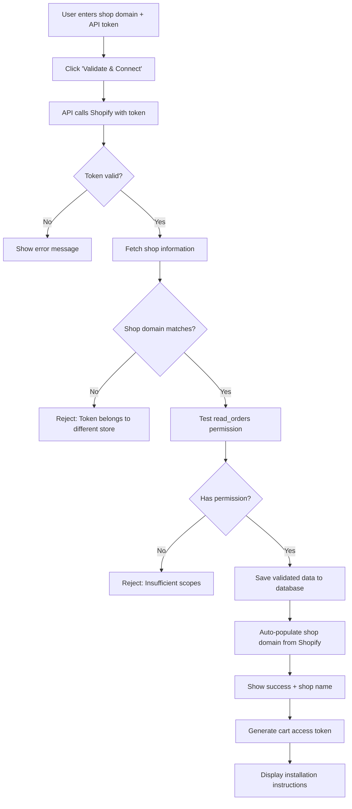

# Shopify Admin API Setup Guide

## 📋 Required Scopes for Revenue Tracking

To track shipping protection sales and generate accurate billing, the Shopify custom app needs the following **Admin API scopes**:

### **Minimum Required Scopes:**

| Scope | Purpose | Required |
|-------|---------|----------|
| `read_orders` | Fetch orders to track protection product sales | ✅ **YES** |

### **Optional but Recommended Scopes:**

| Scope | Purpose | Required |
|-------|---------|----------|
| `read_products` | Verify protection product exists | ⚠️ Optional |
| `read_analytics` | Additional sales analytics (future use) | ❌ No |

---

## 🔧 How to Create Shopify Custom App

### Step 1: Access Shopify Admin
1. Log into your Shopify store admin panel
2. Go to **Settings** (bottom left)
3. Navigate to **Apps and sales channels**

### Step 2: Enable Custom App Development
1. Click **"Develop apps"** (top right)
2. If you see a message about enabling custom app development:
   - Click **"Allow custom app development"**
   - Confirm the action

### Step 3: Create New Custom App
1. Click **"Create an app"** button
2. Enter app name: `XCart Revenue Tracking`
3. App developer: Your name or email
4. Click **"Create app"**

### Step 4: Configure Admin API Scopes
1. Click **"Configure Admin API scopes"**
2. Scroll to find or search for: **Orders**
3. Enable: ✅ `read_orders`
4. Click **"Save"** at the top right

### Step 5: Install the App
1. Click **"Install app"** button
2. Review the permissions
3. Click **"Install"** to confirm

### Step 6: Get API Access Token
1. After installation, you'll see the **Admin API access token**
2. Click **"Reveal token once"**
3. **IMPORTANT:** Copy the token immediately - it won't be shown again!
4. Token format: `shpat_XXXXXXXXXXXXXXXXXXXXXXXX`

---

## 🔐 Security Best Practices

### Token Storage:
- ✅ Store encrypted in database (production)
- ✅ Never commit to git
- ✅ Use environment variables for encryption keys
- ✅ Rotate tokens periodically (every 90 days)

### Token Validation:
- ✅ Validate token on submission (check it works)
- ✅ Verify shop domain matches token
- ✅ Test read_orders permission
- ✅ Re-validate daily during cron job

### Access Control:
- ✅ Each store has unique token
- ✅ Token tied to specific shop_domain
- ✅ Disable cart if token revoked
- ✅ Notify user if validation fails

---

## 🎯 Token Validation Flow



---

## 📊 What We Track with the API

### Daily Cron Job Queries:
```javascript
// Fetch orders from last 24-48 hours
GET /admin/api/2024-01/orders.json?
  created_at_min=2024-01-14T00:00:00Z&
  created_at_max=2024-01-15T23:59:59Z&
  status=any&
  limit=250

// Filter orders containing protection product
orders.forEach(order => {
  const protectionItem = order.line_items.find(
    item => item.product_id === 'shipping-protection' ||
            item.sku === 'SHIPPING-PROTECTION'
  );
  
  if (protectionItem) {
    // Record sale in database
    sales.insert({
      store_id,
      order_id: order.id,
      order_number: order.name,
      protection_price: protectionItem.price * 100, // in cents
      commission: (protectionItem.price * 0.25) * 100, // 25% commission
      created_at: order.created_at
    });
  }
});
```

### What We Store:
- Order ID (for reference and deduplication)
- Order number (human-readable)
- Protection product price
- Commission amount (25% of protection price)
- Order date/time
- Store ID (which store made the sale)

---

## 💰 Revenue Calculation

### Commission Structure:
- **Commission Rate:** 25% of shipping protection price
- **Example:** If protection costs $4.90:
  - Store keeps: $3.67
  - XCart commission: $1.23

### Monthly Billing:
```javascript
// Calculate total commission for the month
SELECT 
  store_id,
  SUM(commission) as total_commission,
  COUNT(*) as protection_sales_count,
  SUM(protection_price) as total_protection_revenue
FROM sales
WHERE month = '2024-01'
GROUP BY store_id;
```

### Invoice Generation:
- Base subscription fee: $0 (or configurable)
- Commission fee: Sum of all protection sales commissions
- **Total Monthly Bill** = Base fee + Commission

---

## 🔍 API Token Validation Checklist

When user submits token, we verify:

- [ ] Token format is valid (`shpat_...`)
- [ ] Can successfully call Shopify API
- [ ] Shop domain from API matches provided domain
- [ ] Token has `read_orders` permission
- [ ] Store not already connected to different user
- [ ] Response includes shop name, id, email

If ALL pass → Save encrypted token + auto-populate domain  
If ANY fail → Show specific error message

---

## 🚨 Error Handling

### Common Errors:

**Invalid Token:**
```
Error: Invalid API token or insufficient permissions
Solution: Regenerate token in Shopify admin
```

**Wrong Store:**
```
Error: This token belongs to different-store.myshopify.com, not your-store.myshopify.com
Solution: Use correct token for your store
```

**Missing Scopes:**
```
Error: API token does not have read_orders permission
Solution: Reconfigure app scopes and reinstall
```

**Store Already Connected:**
```
Error: This Shopify store is already connected to another account
Solution: Contact support if this is your store
```

---

## 📈 Future Enhancements

### Potential Additional Scopes:

| Scope | Use Case |
|-------|----------|
| `read_products` | Verify protection product setup |
| `read_customers` | Customer analytics |
| `read_analytics` | Sales trends |
| `read_inventory` | Stock tracking |
| `write_orders` | Auto-apply protection (future) |

**Note:** Only request scopes you actively use. Shopify merchants are cautious about permissions.

---

## ✅ Implementation Complete

The hybrid validation approach:
1. ✅ User provides BOTH shop domain and token
2. ✅ API validates token works with that domain
3. ✅ API fetches canonical shop info from Shopify
4. ✅ API OVERWRITES user input with Shopify's response
5. ✅ Database always has correct, validated data
6. ✅ Token bound to specific shop domain (security)
7. ✅ Daily cron validates token still works
8. ✅ Cart disabled if token revoked

---

## 📞 Support Resources

- **Shopify API Docs:** https://shopify.dev/docs/api/admin-rest
- **Custom Apps Guide:** https://help.shopify.com/en/manual/apps/app-types/custom-apps
- **API Scopes Reference:** https://shopify.dev/docs/api/usage/access-scopes

---

**Last Updated:** January 2024  
**API Version:** 2024-01 (Shopify Admin API)

